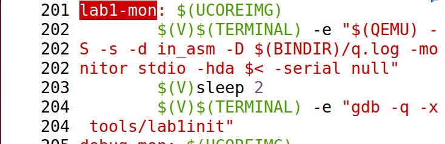

# 操作系统lab1

# 练习二**：使用qemu执行并调试lab1中的软件。**

```bash
 $ cd labcodes_answer/lab1_result/
 $ make lab1-mon
```

进入到lab1_result目录下，使用less命令查看Makefile里的lab1-mon功能



第一个功能为让qemu把它执行的指令给记录下来放到q.log，第二个功能为与gdb结合来可以调试执行中的Bootloader


第二行表示qemu和gdb之间使用网络端口1234进行通讯，第四行表示从0x7c00开始跟踪代码运行,第六行表示获取当前 `$pc`（程序计数器）的值，并从该地址开始，反汇编 **2 条** 机器指令，并以汇编代码形式显示。


显示了对应的两条反汇编


在boots/bootasm.Sz中看到对应的代码比较，发现是一样的


使用continue命令，ucore运行

# 练习四:**分析bootloader加载ELF格式的OS的过程。**

通过阅读bootmain.c，了解bootloader如何加载ELF文件。通过分析源代码和通过qemu来运行并调试bootloader&OS

- bootloader如何读取硬盘扇区的？
 首先了解到磁盘IO地址和对应功能如下：
    
    
    | IO地址 | 功能 |
    | --- | --- |
    | 0x1f0 | 读数据，当0x1f7不为忙状态时，可以读。 |
    | 0x1f2 | 要读写的扇区数，每次读写前，你需要表明你要读写几个扇区。最小是1个扇区 |
    | 0x1f3 | 如果是LBA模式，就是LBA参数的0-7位 |
    | 0x1f4 | 如果是LBA模式，就是LBA参数的8-15位 |
    | 0x1f5 | 如果是LBA模式，就是LBA参数的16-23位 |
    | 0x1f6 | 第0~3位：如果是LBA模式就是24-27位 第4位：为0主盘；为1从盘 |
    | 0x1f7 | 状态和命令寄存器。操作时先给命令，再读取，如果不是忙状态就从0x1f0端口读数据 |
    
    参看boot/bootmain.c中的readsect函数实现，得到读一个扇区流程如下
    
    1. 等待磁盘准备好
    2. 发出读取扇区的命令
    3. 等待磁盘准备好
    4. 把磁盘扇区数据读到指定内存
    
    ```c
    static void
    readsect(void *dst, uint32_t secno) {
        // 等待磁盘准备好
        waitdisk();
    		//发出读取扇区的命令
        outb(0x1F2, 1);                         //表明需要读写一个扇区
        //扇区编号为32位，一次只能传输四位，分四个端口传输给扇区
        outb(0x1F3, secno & 0xFF);              
        outb(0x1F4, (secno >> 8) & 0xFF);
        outb(0x1F5, (secno >> 16) & 0xFF);
        outb(0x1F6, ((secno >> 24) & 0xF) | 0xE0);
        outb(0x1F7, 0x20);                      //发出读指令：0x20
    
        // 等待磁盘准备好
        waitdisk();
    
        // 把磁盘扇区数据读到指定内存
        insl(0x1F0, dst, SECTSIZE / 4);
    }
    ```
    
- bootloader是如何加载ELF格式的OS？
ELF header在文件开始处描述了整个文件的组织。ELF的文件头包含整个执行文件的控制结构，其定义为：
    
    ```c
    struct elfhdr {
      uint magic;  // must equal ELF_MAGIC
      uchar elf[12];
      ushort type;
      ushort machine;
      uint version;
      uint entry;  // 程序入口的虚拟地址
      uint phoff;  // program header 表的位置偏移
      uint shoff;
      uint flags;
      ushort ehsize;
      ushort phentsize;
      ushort phnum; //program header表中的入口数目
      ushort shentsize;
      ushort shnum;
      ushort shstrndx;
    };
    ```
    
    其中提到的program header描述了与程序执行直接相关的目标文件结构信息，用来在文件中定位各个段的映像，同时包含其他一些用来为程序创建进程映像所必需的信息。可执行文件的程序头部是一个program header结构的数组， 每个结构描述了一个段或者系统准备程序执行所必需的其它信息，其定义如下，
    
    ```c
    struct proghdr {
      uint type;   // 段类型
      uint offset;  // 段相对文件头的偏移值
      uint va;     // 段的第一个字节将被放到内存中的虚拟地址
      uint pa;
      uint filesz;
      uint memsz;  // 段在内存映像中占用的字节数
      uint flags;
      uint align;
    };
    ```
    
    目标文件的 “段” 包含一个或者多个 “节区”（section） ，也就是“段内容（Segment Contents）” 。程序头部仅对于可执行文件和共享目标文件有意义。可执行目标文件在ELF头部的e_phentsize和e_phnum成员中给出其自身程序头部的大小。
    通过bootmain.c可以看到，根据elfhdr和proghdr的结构描述，bootloader就可以完成对ELF格式的ucore操作系统的加载过程。
    
    ```c
    void bootmain(void) {
        // read the 1st page off disk
        readseg((uintptr_t)ELFHDR, SECTSIZE * 8, 0);
    
        // is this a valid ELF?
        if (ELFHDR->e_magic != ELF_MAGIC) {
            goto bad;
        }
    
        struct proghdr *ph, *eph;
    
        // load each program segment (ignores ph flags)
        ph = (struct proghdr *)((uintptr_t)ELFHDR + ELFHDR->e_phoff);
        eph = ph + ELFHDR->e_phnum;
        for (; ph < eph; ph ++) {
            readseg(ph->p_va & 0xFFFFFF, ph->p_memsz, ph->p_offset);
        }
    
        // call the entry point from the ELF header
        // note: does not return
        ((void (*)(void))(ELFHDR->e_entry & 0xFFFFFF))();
    
    bad:
        outw(0x8A00, 0x8A00);
        outw(0x8A00, 0x8E00);
    
        /* do nothing */
        while (1);
    }
    ```
    

# 练习五**：实现函数调用堆栈跟踪函数**

### 基础知识

- **EIP**：控制程序执行流程，指向下一条指令，即当前函数的返回地址。
- **ESP**：其内存放着一个指针，该指针永远指向系统栈最上面一个栈帧的栈顶。
- **EBP**：其内存放着一个指针，该指针永远指向系统栈最上面一个栈帧的底部。

几乎所有本地编译器都会在每个函数体之前插入类似如下的汇编指令：

```c
pushl   %ebp
movl   %esp , %ebp
```

栈结构如下

```
+|  栈底方向     | 高位地址
 |    ...       |
 |    ...       |
 |  参数3        |
 |  参数2        |
 |  参数1        |
 |  返回地址     |
 |  上一层[ebp]  | <-------- [ebp]
 |  局部变量     |  低位地址
```

可以看出，ebp寄存器中存储着栈中的一个地址（原ebp入栈后的栈顶），从该地址为基准，向上（栈底方向）能获取返回地址、参数值，向下（栈顶方向）能获取函数局部变量值，而该地址处又存储着上一层函数调用时的ebp值。

### 实验要求

输出的内容有：**ebp**（当前栈帧的基址指针）、**eip**（当前函数中下一条将要执行的指令地址），**args**（当前函数调用时传递的参数，显示4个参数），**源代码位置**（指当前eip（返回地址）对应的源代码位置和函数信息）

### 实现思路

观察需要得到的输出，发现每一帧里ebp,eip地址在不断增大，由于栈往低地址出生长，所以我们需要从栈顶向栈底来输出每一帧的所需信息，我们首先用read_ebp(),read_eip()函数来获得当前栈顶的帧对应信息。

由之前的栈结构图可知，从现ebp往上，我们可以看出eip（返回地址）在ebp+1的位置，即ebp[1]，原ebp在现ebp指向的位置，即ebp[0]，由ebp向上能获取参数值，其在ebp+2的位置，我们按照示例输出打印4个参数值，接下来，我们只差获取源代码位置，我们使用print_debuginfo（）函数来得到，注意这里需要传入的参数是eip-1，而不是eip，因为eip指向的是函数返回后的下一条指令，我们需要显示显示的是调用发生的位置。由此循环，我们可以倒退得到每一个栈帧的信息。

按照思路，写下对应代码如下：


实现效果如下：


### 最后一行的含义

最后一行的堆栈帧信息表明这已经到了操作系统启动流程的最底层，没有函数调用该函数。

# 练习六**：完善中断初始化和处理**

### 中断描述符表

在mmu.h中可以找到，中断描述符表项定义如下：

```c
struct gatedesc {
    unsigned gd_off_15_0 : 16;        // low 16 bits of offset in segment
    unsigned gd_ss : 16;            // segment selector
    unsigned gd_args : 5;            // # args, 0 for interrupt/trap gates
    unsigned gd_rsv1 : 3;            // reserved(should be zero I guess)
    unsigned gd_type : 4;            // type(STS_{TG,IG32,TG32})
    unsigned gd_s : 1;                // must be 0 (system)
    unsigned gd_dpl : 2;            // descriptor(meaning new) privilege level
    unsigned gd_p : 1;                // Present
    unsigned gd_off_31_16 : 16;        // high bits of offset in segment
};
```

一个表项占8个字节，其中段选择子和偏移地址用来代表中断处理程序入口地址，具体先通过选择子查找GDT对应段描述符，得到该代码段的基址，基址加上偏移地址为中断处理程序入口地址。

### idt_init

SETGATE定义宏

```c
#define SETGATE(gate, istrap, sel, off, dpl) {            \
    (gate).gd_off_15_0 = (uint32_t)(off) & 0xffff;        \
    (gate).gd_ss = (sel);                                \
    (gate).gd_args = 0;                                    \
    (gate).gd_rsv1 = 0;                                    \
    (gate).gd_type = (istrap) ? STS_TG32 : STS_IG32;    \
    (gate).gd_s = 0;                                    \
    (gate).gd_dpl = (dpl);                                \
    (gate).gd_p = 1;                                    \
    (gate).gd_off_31_16 = (uint32_t)(off) >> 16;        \
}
```

五个参数的含义分别为：

- gate：中断描述符
- istrap：标识是中断还是系统调用，唯一区别在于，中断会清空IF标志，不允许被打断
- sel：表示段选择子
- off：偏移量（__vectors里面的内容）
- dpl：访问权限

可以看出，SETGATE填充了gatedesc数组，可以生成一个中断描述符表项

我们的任务是利用SETGATE填充idt数组内容，即依次对所有中断入口进行初始化。描述符传入idt数组每一项，istrap设置为0，sel段选择子为GD_KTEXT（因为gdt_init时候是这个数），off偏移量就是传入vector的内容（vector定义在vector.S），权限设置为内核态。再用SETGATE设置特定中断门，最后用lidt(&idt_pd) 加载中断描述符表寄存器（IDTR），完成任务


### trap

TICK_NUM定义为100，有中断产生时,ticks+1，如果中断数累计是TICK_NUM的倍数（操作系统每遇到100次时钟中断时），调用print_ticks子程序，向屏幕上打印一行文字”100 ticks”。按照注释编写即可。


实现效果如下：

