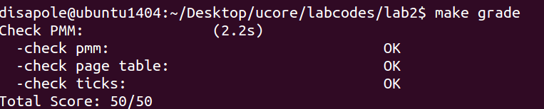

# LAB2 物理内存管理

## 练习1：实现 first-fit 连续物理内存分配算法

`Page` 结构体对应一个物理页，记录了管理该物理页所需的信息。`pages` 变量是一个 `Page` 数组，按顺序对应 ucore 中的所有物理页，因此根据 `pages` 成员的索引，就可以找到实际物理页对应的地址。`free_list` 在 first-fit 分配算法中代表一个个空闲的物理块，每个物理块包含一段连续的空闲页，`free_list` 将空闲块的第一个空闲页链接在一起便于查找。

`Page` 结构体中，`ref` 表示指向该物理页的虚拟页个数。`property` 只对空闲块的第一个空闲页有效，代表该空闲块总共包含的页数。`flags` 包含两个有效位，第 0 位表示该块是否可分配，不可分配的块永远不能放到 `free_list` 管理；第 1 位只对块的第一个页有效，表示该块是否空闲。

```c
struct Page {
    int ref;                        // page frame's reference counter
    uint32_t flags;                 // array of flags that describe the status of the page frame
    unsigned int property;          // used in buddy system, stores the order (the X in 2^X) of the continuous memory block
    int zone_num;                   // used in buddy system, the No. of zone which the page belongs to
    list_entry_t page_link;         // free list link
    list_entry_t pra_page_link;     // used for pra (page replace algorithm)
    uintptr_t pra_vaddr;            // used for pra (page replace algorithm)
};
```

原先代码中几乎已经完全实现了 first-fit 算法，但没有将空闲内存块按照地址从小到大的方式连起来。

1. **完成 `default_init_memmap`**

    `pmm.c` 中的 `page_init()` 会将 BIOS 中检测到的可分配块按顺序调用 `default_init_memmap`。因此该函数的作用就是把接收到的块追加到 `free_list` 末尾。

    原代码将新页面插入链表时，是头插，最终会让地址从大到小排列。因此只需要将 `list_add(&free_list, &(base->page_link))` 改为 `list_add_before(&free_list, &(base->page_link))` 即可。

    ```c
    static void
    default_init_memmap(struct Page *base, size_t n) {
        assert(n > 0);
        struct Page *p = base;
        for (; p != base + n; p ++) {
            assert(PageReserved(p));
            p->flags = p->property = 0;
            set_page_ref(p, 0);
        }
        base->property = n;
        SetPageProperty(base);
        nr_free += n;
        list_add_before(&free_list, &(base->page_link)); // append
    }
    ```

2. **完成 `default_alloc_pages`**

    first-fit 分配内存的逻辑是：从前到后扫描空闲块列表，找到第一个足够大小空闲的块，取出需要的大小，并将多余的部分链回链表。

    在原先的代码中，将剩余空间放回链表时，是直接插入链表头部，并没有按照地址顺序插入链表。修改后代码如下。先将多余部分插入到当前页后面，再删除当前页。注意要设置剩余块第一页的 `property` 为 1，表示该块空闲。

    ```c
    static struct Page *
    default_alloc_pages(size_t n) {
        assert(n > 0);
        if (n > nr_free) {
            return NULL;
        }
        struct Page *page = NULL;
        list_entry_t *le = &free_list;
        while ((le = list_next(le)) != &free_list) {
            struct Page *p = le2page(le, page_link);
            if (p->property >= n) {
                page = p;
                break;
            }
        }
        if (page != NULL) {
            if (page->property > n) {
                struct Page *p = page + n;
                p->property = page->property - n;
                SetPageProperty(p);
                list_add(le, &(p->page_link));
            }
            list_del(&(page->page_link));
            nr_free -= n;
            ClearPageProperty(page);
        }
        return page;
    }
    ```

 3. **完成 `default_free_pages`**

    first-fit 释放内存首先要找到该块按地址顺序应该插入的位置，然后与前后进行可能的合并。原代码已经实现了合并的逻辑。

    原代码的问题是最后会将待释放的页头插入至链表的第一个节点。修改代码，在 `list_add(&free_list, &(base->page_link))` 前先重新遍历链表找到插入位置，即找到第一个在当前块后面的块，如果不存在这样的块则是链表头，然后将释放的块插入到前面。

    ```c
    static void
    default_free_pages(struct Page *base, size_t n) {
        assert(n > 0);
        struct Page *p = base;
        for (; p != base + n; p ++) {
            assert(!PageReserved(p) && !PageProperty(p));
            p->flags = 0;
            set_page_ref(p, 0);
        }
        base->property = n;
        SetPageProperty(base);
        list_entry_t *le = list_next(&free_list);
        while (le != &free_list) {
            p = le2page(le, page_link);
            le = list_next(le);
            if (base + base->property == p) {
                base->property += p->property;
                ClearPageProperty(p);
                list_del(&(p->page_link));
            }
            else if (p + p->property == base) {
                p->property += base->property;
                ClearPageProperty(base);
                base = p;
                list_del(&(p->page_link));
            }
        }
        // 重新查找插入位置
        le = &free_list;
        while ((le = list_next(le)) != &free_list) {
            p = le2page(le, page_link);
            if (base + base->property < p) {
                break;
            }
        }
        list_add_before(le, &(base->page_link));
        nr_free += n;
    }
    ```

> 你的 first fit 算法是否有进一步的改进空间？

可以看到无论是 alloc 过程还是 free 过程都需要 O(n) 的复杂度。如果使用 first fit 算法，我认为以上代码效率低的主要原因在于使用双向链表组织所有的 block，这导致访问必须耗费线性时间。因此可以考虑使用树状结构组织等其他数据结构。

## 练习2：实现寻找虚拟地址对应的页表项

`get_pte` 函数找到一个虚地址对应的二级页表项的内核虚地址。如果在查找二级页表项时，发现对应的二级页表不存在，则需要根据 `create` 参数的值来处理是否创建新的二级页表。如果 `create` 参数为 0，则 `get_pte` 返回 `NULL`；如果 `create` 参数不为 0，则 `get_pte` 需要申请一个新的物理页（通过 `alloc_page` 来实现，可在 `mm/pmm.h` 中找到它的定义），再在一级页表中添加页目录项指向表示二级页表的新物理页。注意，新申请的页必须全部设定为零，因为这个页所代表的虚拟地址都没有被映射。

由于已经开启了地址映射，所有对地址的访问应该通过虚拟地址进行（使用 `KADDR`）。

```c
pte_t *
get_pte(pde_t *pgdir, uintptr_t la, bool create) {
    pde_t *pdep = &pgdir[PDX(la)];  // (1) find page directory entry
    if (!(*pdep & PTE_U)) {         // (2) check if entry is not present
        if (create) {               // (3) check if creating is needed, then alloc page for page table
            struct Page *page = alloc_page();   // CAUTION: this page is used for page table, not for common data page
            if (page == NULL) {
                return NULL;
            }
            set_page_ref(page, 1);              // (4) set page reference
            uintptr_t page_pa = page2pa(page);  // (5) get linear address of page
            memset(KADDR(page_pa), 0, PGSIZE);  // (6) clear page content using memset
            *pdep = page_pa | PTE_P | PTE_W | PTE_U;    // (7) set page directory entry's permission
        } else {
            return NULL;
        }               
    }
    return &((pte_t *)KADDR(PDE_ADDR(*pdep)))[PTX(la)]; // (8) return page table entry
}
```

> 请描述页目录项（Page Directory Entry）和页表项（Page Table Entry）中每个组成部分的含义和以及对 ucore 而言的潜在用处。

PDE 是页目录表中的一项，用于指向下一级页表的物理地址和控制信息。PTE 是页表中的一项，用于指向物理页帧的地址和控制信息。二者结构如下：

1. 12~31 位是页表 / 物理页基址，对应的物理地址的高 20 位（低 12 位为 0）。用于定位下一级页表 / 物理页帧的物理地址。

2. 0~11 位是控制位。根据 `mmu.h` 中的定义，控制位从低到高依次是：

    |位	| 名称       | 含义                | 潜在用处 |
    |---|------------|--------------------|---------|
    |0	| `PTE_P`      | 物理内存页存在 |  |
    |1	| `PTE_W`      | 是否可写     | 实现对代码段、只读数据段的保护 |
    |2	| `PTE_U`      | 用户是否可访问 | 保护内核空间不被用户进程直接访问和修改 |
    |3	| `PTE_PWT`    | 是否写直达 |
    |4	| `PTE_PCD`    | 是否禁用缓存，所有对该页的访问都直接读写主存|
    |5	| `PTE_A`      | 是否被访问 |  像 Clock 算法或其变种会使用此位来判断页面最近是否被访问过，从而决定哪些页面是“较少使用”的，可以作为换出的候选者|
    |6	| `PTE_D`      | 是否被写过 (只对 PTE 有效) | 当选择一个页面换出时，如果 `PTE_D` 为 1，表示页面内容已被修改，需要将其写回磁盘才能释放该物理页。如果为 0，则页面内容未变，可以直接丢弃|
    |7,8| `PTE_MBZ`    | 这两位必须为 0 |
    |9,10,11	| `PTE_AVAIL` | 未被使用的位，可以由软件自己设置 |

> 如果 ucore 执行过程中访问内存，出现了页访问异常，请问硬件要做哪些事情？

1. 将导致异常的线性地址存入 `CR2` 寄存器。

2. 保护现场：CPU 将当前寄存器的值压入栈中保存，设置错误代码。

3. CPU 根据中断向量号找到中断描述符表中的处理函数，控制权转移到中断服务例程的入口点。

4. 恢复现场：中断服务例程执行完毕后，CPU 从栈中弹出之前硬件保存的寄存器值，重新执行触发异常的指令。

## 练习3：释放某虚地址所在的页并取消对应二级页表项的映射

首先，如果该表项本身就不存在，直接返回。

如果存在，先将 `pte` 转换到对应的 `Page` 结构，将 `page` 的 `ref` 递减。如果 `ref` 为 0，说明已经没有虚拟页指向该物理页了，应该释放掉物理页的资源。

最后还需把表示虚地址与物理地址对应关系的二级页表项清除，并刷新 TLB。

```c
static inline void
page_remove_pte(pde_t *pgdir, uintptr_t la, pte_t *ptep) {
    if (!(*ptep & PTE_D)) //(1) check if this page table entry is present
        return;
    struct Page *page = pte2page(*ptep); //(2) find corresponding page to pte
    page_ref_dec(page);                  //(3) decrease page reference
    if (page->ref == 0)  //(4) and free this page when page reference reachs 0
        free_page(page);
    *ptep = 0;           //(5) clear second page table entry
    tlb_invalidate(pgdir, la); //(6) flush tlb
}
```

> 数据结构 `Page` 的全局变量（其实是一个数组）的每一项与页表中的页目录项和页表项有无对应关系？如果有，其对应关系是啥？

`Page` 代表物理页，虚拟地址通过自己的高 20 位作为索引找到对应的页目录项和页表项，页表项最终指向虚拟地址对应的物理地址，也就是物理页。当页目录项或页表项有效时，`Page` 数组中的项 `page` 与页目录项或页表项存在对应关系。

首先物理地址是与 `page` 一一对应的（参考 `pa2page` 函数）。

页表项指向一个物理页的物理地址，页目录项指向一个页表的物理地址，而一个页表本身也占据一个页，因此页表项和页目录项指向的地址可以对应到 `page`。但 `page` 反过来不一定唯一对应到页目录项和页表项，可能对应多个虚拟页。

> 如果希望虚拟地址与物理地址相等，则需要如何修改 lab2，完成此事？ **鼓励通过编程来具体完成这个问题**

**原本 lab2 中 ucore 地址映射的变化过程如下：**

1. bootloader 阶段：即从 bootloader 的 `start` 函数（在 `boot/bootasm.S` 中）到执行 ucore kernel 的 `kern_entry` 函数之前，其虚拟地址，线性地址以及物理地址之间的映射关系与 lab1 的一样，即：`virt addr = linear addr = phy addr`

2. 从 `kern_entry` 函数开始，到执行 `enable_page` 函数（在 `kern/mm/pmm.c` 中）之前再次更新了段映射，还没有启动页映射机制。由于 gcc 编译出的虚拟起始地址从 `0xC0100000` 开始，ucore 被 bootloader 放置在从物理地址 `0x100000` 处开始的物理内存中。所以当 `kern_entry` 函数完成新的段映射关系后，且 ucore 在没有建立好页映射机制前，CPU 按照 ucore 中的虚拟地址执行，能够被分段机制映射到正确的物理地址上，确保 ucore 运行正确。这时的虚拟地址，线性地址以及物理地址之间的映射关系为 `virt addr - 0xC0000000 = linear addr = phy addr`

3. 从 `enable_page` 函数开始，到执行 `gdt_init` 函数（在 `kern/mm/pmm.c` 中）之前，启动了页映射机制，但没有第三次更新段映射。这时的虚拟地址，线性地址以及物理地址之间的映射关系比较微妙：
```
virt addr - 0xC0000000 = linear addr  = phy addr + 0xC0000000 # 物理地址在 0~4MB 之外的三者映射关系
virt addr - 0xC0000000 = linear addr  = phy addr # 物理地址在 0~4MB 之内的三者映射关系
```
`pmm_init` 函数中的一条语句：`boot_pgdir[0] = boot_pgdir[PDX(KERNBASE)];` 就是用来建立物理地址在 0~4MB 之内的三个地址间的临时映射关系 `virt addr - 0xC0000000 = linear addr = phy addr`。

4. 从 `gdt_init` 函数开始，第三次更新了段映射，形成了新的段页式映射机制，并且取消了临时映射关系，即执行语句 `boot_pgdir[0] = 0;` 把 `boot_pgdir[0]` 的第一个页目录表项（0~4MB）清零来取消临时的页映射关系。这时形成了我们期望的虚拟地址，线性地址以及物理地址之间的映射关系 `virt addr = linear addr = phy addr + 0xC0000000`

**分析以上过程，如果希望虚拟地址与物理地址相等，需要做以下修改**

1. 首先让内核被链接到物理内存的实际加载地址，修改 `tool/kernel.ld` 文件, 将 `. = 0xC0100000` 修改为 `. = 0x100000`

2. 修改 `kern/mm/memlayout.h` 中的 `KERNBASE` 宏定义为 `0x00000000`。将其改为 0 意味着内核的虚拟地址空间将从 0 开始，与物理地址空间对齐

3. 去除 `pmm_init.c` 中的临时映射及取消临时映射机制。`boot_pgdir[0] = boot_pgdir[PDX(KERNBASE)];` 这条语句原本是为了在启用分页初期，能够通过低地址（虚拟地址 0 到 4MB）访问到内核（物理地址 0 到 4MB，因为此时内核的虚拟地址在高位）。`boot_pgdir[0] = 0;` 这条语句原本是用来取消上述临时映射的。在 `KERNBASE` 为 0 的情况下，内核本身就位于低虚拟地址，不再需要这种临时映射来访问低物理地址的内核，因此需要删除这两条代码。同时注释掉 `check_boot_pgdir()` 函数。

修改后 `make qemu` 终端输出如下，可以看到地址都由 `0xc` 开头变为 `0x0` 开头。
```
Special kernel symbols:
  entry  0x0010002a (phys)
  etext  0x00105eec (phys)
  edata  0x00117a36 (phys)
  end    0x00118968 (phys)
Kernel executable memory footprint: 99KB
ebp:0x00116f38 eip:0x001009d0 arg:0x00010094 0x00000000 0x00116f68 0x001000bc 
    kern/debug/kdebug.c:309: print_stackframe+21
ebp:0x00116f48 eip:0x00100ccb arg:0x00000000 0x00000000 0x00000000 0x00116fb8 
    kern/debug/kmonitor.c:129: mon_backtrace+10
ebp:0x00116f68 eip:0x001000bc arg:0x00000000 0x00116f90 0xffff0000 0x00116f94 
    kern/init/init.c:49: grade_backtrace2+33
ebp:0x00116f88 eip:0x001000e5 arg:0x00000000 0xffff0000 0x00116fb4 0x00000029 
    kern/init/init.c:54: grade_backtrace1+38
ebp:0x00116fa8 eip:0x00100103 arg:0x00000000 0x0010002a 0xffff0000 0x0000001d 
    kern/init/init.c:59: grade_backtrace0+23
ebp:0x00116fc8 eip:0x00100128 arg:0x00105f1c 0x00105f00 0x00000f32 0x00000000 
    kern/init/init.c:64: grade_backtrace+34
ebp:0x00116ff8 eip:0x0010007f arg:0x00000000 0x00000000 0x0000ffff 0x00cf9a00 
    kern/init/init.c:29: kern_init+84
memory management: default_pmm_manager
e820map:
  memory: 0009fc00, [00000000, 0009fbff], type = 1.
  memory: 00000400, [0009fc00, 0009ffff], type = 2.
  memory: 00010000, [000f0000, 000fffff], type = 2.
  memory: 07efe000, [00100000, 07ffdfff], type = 1.
  memory: 00002000, [07ffe000, 07ffffff], type = 2.
  memory: 00040000, [fffc0000, ffffffff], type = 2.
check_alloc_page() succeeded!
check_pgdir() succeeded!
-------------------- BEGIN --------------------
PDE(0e0) 00000000-38000000 38000000 urw
  |-- PTE(38000) 00000000-38000000 38000000 -rw
PDE(001) fac00000-fb000000 00400000 -rw
  |-- PTE(000e0) fac00000-face0000 000e0000 urw
  |-- PTE(00001) fafeb000-fafec000 00001000 -rw
--------------------- END ---------------------
++ setup timer interrupts
100 ticks
```

## 实验结果

运行 `make grade` 得到满分：



