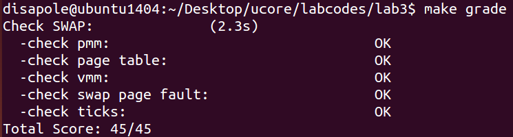
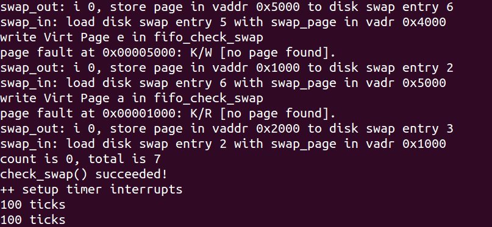

# LAB3 虚拟内存管理

## 练习1：给未被映射的地址映射上物理页

`vma_struct` 是一个连续虚拟地址区域，`mm_struct` 用来管理多个 `vma_struct`，代表合法的虚拟空间。二者的关系类似 `lab2` 中的空闲块与 `free_list`。

`do_pgfault` 函数是完成页错误异常处理的主要函数，它根据 CPU 的控制寄存器 `CR2` 中获取的页错误异常的虚拟地址，以及根据 `error code` 的错误类型来查找次虚拟地址是否在某个 VMA 的地址范围内，并且是否满足正确的读写权限。

- 如果在此范围内并且权限也正确，就认为这是一次合法访问，但没有建立虚实对应关系，所以需要分配一个空闲的内存页，并修改页表完成虚地址到物理地址的映射，刷新 TLB，然后调用 `iret` 中断，返回并重新执行。
- 如果该虚地址不在某 VMA 范围内，这认为是一个非法访问。

EXERCISE 1 中我们要补全的代码是 `do_pgfault` 已经判定该访问合法后，分配一个空闲物理页的部分。先使用在 `lab2` 中实现的 `get_pte` 获取虚拟地址对应的页表项，如果页表项内容为空（全为 0），说明这是一个新建的空闲页表项，还没有分配物理页。调用 `pgdir_alloc_page` 分配一个物理页并与该页表项建立映射。

```c
int
do_pgfault(struct mm_struct *mm, uint32_t error_code, uintptr_t addr) {
    int ret = -E_INVAL;
    //try to find a vma which include addr
    struct vma_struct *vma = find_vma(mm, addr);

    pgfault_num++;
    //If the addr is in the range of a mm's vma?
    if (vma == NULL || vma->vm_start > addr) { // 不在任何 VMA 范围内
        cprintf("not valid addr %x, and  can not find it in vma\n", addr);
        goto failed;
    }
    //check the error_code
    switch (error_code & 3) {
    default:
            /* error code flag : default is 3 ( W/R=1, P=1): write, present */
    case 2: /* error code flag : (W/R=1, P=0): write, not present */
        if (!(vma->vm_flags & VM_WRITE)) {
            cprintf("do_pgfault failed: error code flag = write AND not present, but the addr's vma cannot write\n");
            goto failed;
        }
        break;
    case 1: /* error code flag : (W/R=0, P=1): read, present */
        cprintf("do_pgfault failed: error code flag = read AND present\n");
        goto failed;
    case 0: /* error code flag : (W/R=0, P=0): read, not present */
        if (!(vma->vm_flags & (VM_READ | VM_EXEC))) {
            cprintf("do_pgfault failed: error code flag = read AND not present, but the addr's vma cannot read or exec\n");
            goto failed;
        }
    }
    /* IF (write an existed addr ) OR
     *    (write an non_existed addr && addr is writable) OR
     *    (read  an non_existed addr && addr is readable)
     * THEN
     *    continue process
     */
    uint32_t perm = PTE_U;
    if (vma->vm_flags & VM_WRITE) {
        perm |= PTE_W;
    }
    addr = ROUNDDOWN(addr, PGSIZE);

    ret = -E_NO_MEM;

    pte_t *ptep=NULL;

    /*LAB3 EXERCISE 1: YOUR CODE*/
    ptep = get_pte(mm->pgdir, addr, 1); //(1) try to find a pte, if pte's PT(Page Table) isn't existed, then create a PT.
    if (*ptep == 0) {
        if(pgdir_alloc_page(mm->pgdir, addr, perm) == NULL) { //(2) if the phy addr isn't exist, then alloc a page & map the phy addr with logical addr
            cprintf("pgdir_alloc_page failed!");  
            goto failed;
        }
    }
    else {
    // ... EXERCISE 2 code

}
```

> 请描述页目录项 (Page Directory Entry) 和页表项 (Page Table Entry) 中组成部分对 ucore 实现页替换算法的潜在用处。

页目录项和页表项的第 5 位 `PTE_A` 和第 6 位 `PTE_D` 的控制位与页替换算法的实现有关。

- `PTE_A` 表示是否被访问，像 Clock 算法或其变种会使用此位来判断页面最近是否被访问过，从而决定哪些页面是“较少使用”的，可以作为换出的候选者。
- `PTE_D` 表示是否被写过 (只对 `PTE` 有效)，当选择一个页面换出时，如果 `PTE_D` 为 `1`，表示页面内容已被修改，需要将其写回磁盘才能释放该物理页。如果为 `0`，则页面内容未变，可以直接丢弃。

> 如果 ucore 的缺页服务例程在执行过程中访问内存，出现了页访问异常，请问硬件要做哪些事情？

如果 ucore 的缺页服务例程 (`page fault handler`) 在其执行过程中自己又访问了内存，并且这次访问再次导致了页访问异常，这种情况被称为双重故障 (Double Fault)。

CPU 会尝试调用双重故障处理程序。双重故障有其固定的中断向量号，即向量号 8。CPU 会查找中断描述符表 (IDT) 中索引为 8 的门描述符，以获取双重故障处理程序的入口地址。

接着如同普通中断过程，CPU 会压栈错误码、保护现场，再将控制权转移到 `IDT[8]` 指定的双重故障处理程序的入口点。

查看 `trap.c` `trap_dispatch()` 会发现并没有对双重故障 (`T_DBLFLT`) 做单独处理，将执行 `default` 分支，最终导致打印 `trapframe` 信息并 panic。

## 练习2：补充完成基于FIFO的页面替换算法

FIFO 替换算法会维护一个队列，队列按照页面调用的次序排列，越早被加载到内存的页面会越早被换出。

为了表示物理页可被换出或已被换出的情况，可对 `Page` 数据结构进行扩展：`pra_page_link` 可用来构造按页的第一次访问时间（调入内存时间）进行排序的一个链表，这个链表的开始表示第一次访问时间最近的页，链表结尾表示第一次访问时间最远的页。当然链表头可以就可设置为 `pra_list_head`（定义在 `swap_fifo.c` 中）。`pra_vaddr` 可以用来记录此物理页对应的虚拟页起始地址。

在 FIFO 中 `mm->sm_priv` 就指向 `pra_list_head`，将 `mm` 与替换算法关联起来。

我们要接着 EXERCISE 1 完成 `do_pgfault`。在 EXERCISE 2 中我们要完成的部分是当获得的页表项不是空的，这代表着什么呢？

在 ucore 中，当一个 `PTE` 用来描述一般意义上的物理页时，显然它应该维护各种权限和映射关系，以及应该有 `PTE_P` 标记；但当它用来描述一个被置换出去的物理页时，它被用来维护该物理页与 `swap` 磁盘上扇区的映射关系，并且该 `PTE` 不应该由 MMU 将它解释成物理页映射 (即没有 `PTE_P` 标记)，与此同时对应的权限则交由 `mm_struct` 来维护，当对位于该页的内存地址进行访问的时候，必然导致 `page fault`，然后 ucore 能够根据 `PTE` 描述的 `swap` 项将相应的物理页重新建立起来，并根据虚存所描述的权限重新设置好 `PTE` 使得内存访问能够继续正常进行。

此外，为了在页表项中区别 `0` 和 `swap` 分区的映射，将 `swap` 分区的一个 `page` 空出来不用，也就是说一个高 24 位不为 `0`，而最低位为 `0` 的 `PTE` 表示了一个放在硬盘上的页的起始扇区号。

因此，在这种情况下，我们要读取页表项指向的磁盘位置所存储的物理页到一个新分配的页，这一部分由 `swap_in()` 函数完成，然后再建立页表项与新页的关联。最后将这个刚刚换入的页面标记为“可交换的”，也就是链接到 `sm_priv`，这意味着它现在进入了页面置换算法 PRA 的管理范围，然后设置另一个与交换有关的属性 `pra_vaddr` 即可。

```c
// ... EXERCISE 1 code
    else {
        if(swap_init_ok) {
            struct Page *page=NULL;
            swap_in(mm, addr, &page);   //(1）According to the mm AND addr, try to load the content of right disk page
                                        //    into the memory which page managed.
            page_insert(mm->pgdir, page, addr, perm);   //(2) According to the mm, addr AND page, setup the map of phy addr <---> logical addr
            swap_map_swappable(mm, addr, page, 1);      //(3) make the page swappable.
            page->pra_vaddr = addr;                        
        } else {
            cprintf("no swap_init_ok but ptep is %x, failed\n",*ptep);
            goto failed;
        }
   }
   ret = 0;
failed:
    return ret;
}
```

`_fifo_map_swappable` 负责将新调入内存的页加到 `mm->sm_priv` 链表，按照调入时间排列 `page`。要将最新的页插到队列尾，只需要插入 `head` 前面即可。

`_fifo_swap_out_victim` 负责选择一个页换出，选择的标准是进入内存最早的页，即队首，选出页后将该页从页替换链表上删除，并返回页。

```c
/*
 * (3)_fifo_map_swappable: According FIFO PRA, we should link the most recent arrival page at the back of pra_list_head qeueue
 */
static int
_fifo_map_swappable(struct mm_struct *mm, uintptr_t addr, struct Page *page, int swap_in)
{
    list_entry_t *head=(list_entry_t*) mm->sm_priv;
    list_entry_t *entry=&(page->pra_page_link);
 
    assert(entry != NULL && head != NULL);
    //record the page access situlation
    /*LAB3 EXERCISE 2: YOUR CODE*/ 
    //(1)link the most recent arrival page at the back of the pra_list_head qeueue.
    list_add_before(head, entry);
    return 0;
}
/*
 *  (4)_fifo_swap_out_victim: According FIFO PRA, we should unlink the  earliest arrival page in front of pra_list_head qeueue,
 *                            then set the addr of addr of this page to ptr_page.
 */
static int
_fifo_swap_out_victim(struct mm_struct *mm, struct Page ** ptr_page, int in_tick)
{
     list_entry_t *head=(list_entry_t*) mm->sm_priv;
         assert(head != NULL);
     assert(in_tick==0);
     /* Select the victim */
     /*LAB3 EXERCISE 2: YOUR CODE*/ 
     //(1)  unlink the  earliest arrival page in front of pra_list_head qeueue
     //(2)  set the addr of addr of this page to ptr_page
     /* Select the tail */
     list_entry_t *le = list_next(head);
     struct Page *p = le2page(le, pra_page_link);
     list_del(le);
     *ptr_page = p;
     return 0;
}
```

> 如果要在 ucore 上实现 "extended clock 页替换算法" 请给你的设计方案，现有的 `swap_manager` 框架是否足以支持在 ucore 中实现此算法？如果是，请给你的设计方案。如果不是，请给出你的新的扩展和基此扩展的设计方案。并需要回答如下问题：
    - 需要被换出的页的特征是什么？
    - 在 ucore 中如何判断具有这样特征的页？
    - 何时进行换入和换出操作？
        
**需要被换出的页的特征是什么？**
extended clock 算法除了考虑页面的访问情况，还需考虑页面的修改情况。即该算法不但希望淘汰的页面是最近未使用的页，而且还希望被淘汰的页是在主存驻留期间其页面内容未被修改过的。(0,0) 表示最近未被引用也未被修改，首先选择此页淘汰；(0,1) 最近未被使用，但被修改，其次选择；(1,0) 最近使用而未修改，再次选择；(1,1) 最近使用且修改，最后选择。由于遍历可能无法找到 (0,0) 的页面，extended clock 算法会边遍历边修改标志位。具体来说：
- 第一轮：从当前位置开始扫描到第一个 (0,0) 的帧用于替换。本轮扫描不修改任何标志位。
- 第二轮：若第一轮扫描失败，则重新扫描，查找第一个 (0,1) 的帧用于替换。本轮将所有扫描过的帧访问位设为 `0`。
- 第三轮：若第二轮扫描失败，则重新扫描，查找第一个 (0,0) 的帧用于替换。本轮扫描不修改任何标志位。
- 第四轮：若第三轮扫描失败，则重新扫描，查找第一个 (0,1) 的帧用于替换。

**在 ucore 中如何判断具有这样特征的页**：ucore 的页表项中已经存在标志位 `PTE_A` 和 `PTE_D` 表示访问和修改。当该页被访问时，CPU 中的 MMU 硬件将把访问位置 `1`。当该页被“写”时，CPU 中的 MMU 硬件将把修改位置 `1`，这样就可以判断了。

**何时进行换入和换出操作**：与 FIFO 相同，缺页时进行换入操作，没有可分配的物理帧时进行换出操作。

## 实验结果

输入 `make grade` 达到满分：



