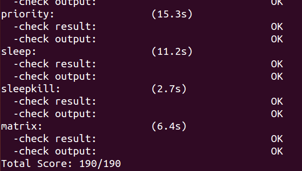
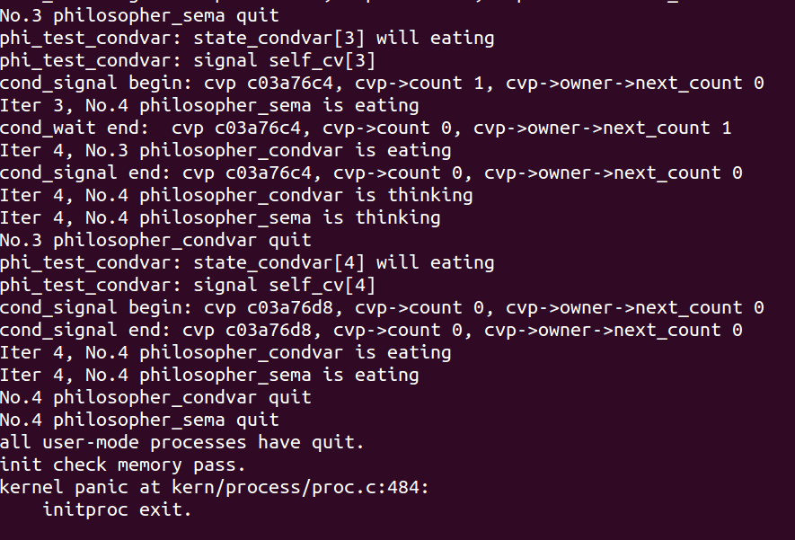

# LAB7 同步互斥

## 练习1: 理解内核级信号量的实现和基于内核级信号量的哲学家就餐问题

信号量实现哲学家就餐问题首先定义了一些全局变量：

- `state_sema[N]`：记录每个哲学家的状态 (`THINKING=0`, `HUNGRY=1`, `EATING=2`)
- `mutex`：互斥信号量，初始值为 1，保证同一时刻只有一个线程可以修改状态数组
- `s[N]`：每个哲学家的信号量，初始值为 0，控制哲学家的进餐行为

`check_sync()` 利用 `kernel_thread()` 函数循环创建了哲学家就餐问题的内核线程，该线程执行函数 `philosopher_using_semaphore()`。每个哲学家的逻辑较简单，循环进行思考 -> 等待叉子 -> 进餐 -> 放回叉子。

```c
int philosopher_using_semaphore(void * arg) /* i：哲学家号码，从 0 到 N-1 */
{
    int i, iter=0;
    i=(int)arg;
    cprintf("I am No.%d philosopher_sema\n",i);
    while(iter++<TIMES)
    {
        cprintf("Iter %d, No.%d philosopher_sema is thinking\n",iter,i); /* 哲学家正在思考 */
        do_sleep(SLEEP_TIME);
        phi_take_forks_sema(i); 
        /* 需要两只叉子，或者阻塞 */
        cprintf("Iter %d, No.%d philosopher_sema is eating\n",iter,i); /* 进餐 */
        do_sleep(SLEEP_TIME);
        phi_put_forks_sema(i); 
        /* 把两把叉子同时放回桌子 */
    }
    cprintf("No.%d philosopher_sema quit\n",i);
    return 0;    
}
```
分析拿叉子的过程。首先获得访问餐桌的信号量 `mutex`，确保同时只有一个人访问餐桌。然后设置状态为饥饿，这样可以让其他哲学家知道自己的状态，从而在有空闲餐具时唤醒自己。

接着调用 `phi_test_sema()` 函数。该函数首先判断哲学家 `i` 是否需要进餐 (状态为 `HUNGRY`) 以及是否有足够的餐具 (左右两边的人都不在进餐)，如果满足条件则哲学家可以开始进餐更新状态，释放一个 `s[i]` 信号量用于同步外侧的 `phi_take_forks_sema`。

最后哲学家首先释放餐桌的信号量，再等待叉子信号量，防止因等不到叉子而霸占餐桌，使得其他人无法放回叉子造成死锁。如果刚刚的 `phi_test_sema` 函数已经验证有空闲餐具，那么它释放的叉子信号量直接使得 `down(&s[i])` 执行成功。否则该哲学家将睡眠，等待有餐具时被叫醒。

```c
void phi_test_sema(i) /* i：哲学家号码从 0 到 N-1 */
{ 
    if(state_sema[i] == HUNGRY && state_sema[LEFT] != EATING
            && state_sema[RIGHT] != EATING)
    {
        state_sema[i] = EATING;
        up(&s[i]);
    }
}

void phi_take_forks_sema(int i) /* i：哲学家号码从 0 到 N-1 */
{ 
        down(&mutex); /* 进入临界区 */
        state_sema[i] = HUNGRY; /* 记录下哲学家 i 饥饿的事实 */
        phi_test_sema(i); /* 试图得到两只叉子 */
        up(&mutex); /* 离开临界区 */
        down(&s[i]); /* 如果得不到叉子就阻塞 */
}
```
分析放回叉子的过程。同样首先获得餐桌信号量。更新自己的状态为思考。因为自己已经用餐完毕，有空余的左右两只叉子，于是调用 `phi_test_sema` 测试左邻居和右邻居是否需要且可以进餐，如果可以则增加他们的叉子信号量唤醒他们。最后离开餐桌。

```c

void phi_put_forks_sema(int i) /* i：哲学家号码从 0 到 N-1 */
{ 
        down(&mutex); /* 进入临界区 */
        state_sema[i] = THINKING; /* 哲学家进餐结束 */
        phi_test_sema(LEFT); /* 看一下左邻居现在是否能进餐 */
        phi_test_sema(RIGHT); /* 看一下右邻居现在是否能进餐 */
        up(&mutex); /* 离开临界区 */
}
```

> 请在实验报告中给出内核级信号量的设计描述，并说其大致执行流流程。

ucore 中的信号量定义在 `sem.h` 中，其数据结构如下：

```c
typedef struct {
    int value;
    wait_queue_t wait_queue;
} semaphore_t;
```

其中：
- `value`：表示信号量的计数值，代表可用资源数量
- `wait_queue`：等待队列，当进程因为资源不足而阻塞时，会被添加到这个队列中

ucore 实现了信号量的以下基本操作：

- 初始化操作 (`sem_init`)
    ```c
    void sem_init(semaphore_t *sem, int value) {
        sem->value = value;
        wait_queue_init(&(sem->wait_queue));
    }
    ```

- 获取信号量 (`down`)
    核心实现在 `__down` 函数中：
   1. 关闭中断，以确保操作的原子性
   2. 检查信号量值：
      - 如果 `value > 0`，则将值减 1 并返回
      - 否则，创建等待项，将当前进程加入等待队列
   3. 恢复中断，并调用 `schedule()` 让出 CPU
   4. 当进程被重新调度执行时，从等待队列中删除等待项

    ```c
    static __noinline uint32_t __down(semaphore_t *sem, uint32_t wait_state) {
        bool intr_flag;
        local_intr_save(intr_flag);
        if (sem->value > 0) {
            sem->value --;
            local_intr_restore(intr_flag);
            return 0;
        }
        wait_t __wait, *wait = &__wait;
        wait_current_set(&(sem->wait_queue), wait, wait_state);
        local_intr_restore(intr_flag);

        schedule();

        local_intr_save(intr_flag);
        wait_current_del(&(sem->wait_queue), wait);
        local_intr_restore(intr_flag);

        if (wait->wakeup_flags != wait_state) {
            return wait->wakeup_flags;
        }
        return 0;
    }
    ```

- 释放信号量 (`up`)
    核心实现在 `__up` 函数中：
    1. 关闭中断，确保原子性
    2. 检查等待队列：
       - 如果等待队列为空，直接将信号量值加 1
       - 如果等待队列非空，则唤醒队列中的第一个等待进程
    3. 恢复中断
   
    ```c
    static __noinline void __up(semaphore_t *sem, uint32_t wait_state) {
        bool intr_flag;
        local_intr_save(intr_flag);
        {
            wait_t *wait;
            if ((wait = wait_queue_first(&(sem->wait_queue))) == NULL) {
                sem->value ++;
            }
            else {
                assert(wait->proc->wait_state == wait_state);
                wakeup_wait(&(sem->wait_queue), wait, wait_state, 1);
            }
        }
        local_intr_restore(intr_flag);
    }
    ```

> 请在实验报告中给出给用户态进程/线程提供信号量机制的设计方案，并比较说明给内核级提供信号量机制的异同。

操作系统提供一些操作信号量的系统调用接口，用户态进程通过系统调用来使用信号量。可以设计以下简单接口：

- 申请创建一个信号量的系统调用，可以指定初始值，返回一个信号量描述符（类似文件描述符）；
- 将指定信号量执行 P 操作；
- 将指定信号量执行 V 操作；
- 将指定信号量释放掉；

与内核级线程提供信号量机制的异同：

- 相同点：提供信号量机制的代码实现逻辑是相同的；
- 不同点：提供给用户态进程的信号量机制是通过系统调用来实现的，而内核级线程只需要直接调用相应的函数就可以了

## 练习2: 完成内核级条件变量和基于内核级条件变量的哲学家就餐问题

1. 实现 `cond_signal`

    - 如果不存在线程正在等待待释放的条件变量，则不执行任何操作

    - 否则，对传入条件变量内置的信号执行 V 操作。注意：这一步可能会唤醒某个等待线程。

    - 函数内部接下来会执行 `down(&(cvp->owner->next))` 操作。由于 `monitor::next` 在初始化时就设置为 0，所以当执行到该条代码时，无论如何，当前正在执行 `cond_signal` 函数的线程一定会被挂起。这也正是管程中 `next` 信号量的用途。

    基于实验已有的实现思路，我们只需要把其中的结构翻译为 ucore 所设计的管程和条件变量的结构即可。具体来说条件变量 `cv` 替换为 `cvp` 指针，管程 `mt` 通过 `cvp->owner` 来获取。`signal` 和 `wait` 使用我们自己定义的信号量函数 `sem_signal`, `sem_wait`。
    ```c
    cond_signal (condvar_t *cvp) {
        if (cvp->count > 0) {
            cvp->owner->next_count++;
            up(&(cvp->sem));
            down(&(cvp->owner->next));
            cvp->owner->next_count--;
        }  
    }
    ```

2. 实现 `cond_wait`

    - 当某个线程因为等待条件变量而准备将自身挂起前，此时条件变量中的 `count` 变量应自增 1。

    - 之后当前进程应该释放所等待的条件变量所属的管程互斥锁，以便于让其他线程执行管程代码。
    
    但如果存在一个已经在管程中、但因为执行 `cond_signal` 而挂起的线程，则优先继续执行该线程。
    
    如果程序选择执行 `up(&(cvp->owner->next))`，请注意：此时 `mutex` 没有被释放。因为当前线程将被挂起，原先存在于管程中的线程被唤醒，此时管程中仍然只有一个活跃线程，不需要让新的线程进入管程。

    - 释放管程后，尝试获取该条件变量。如果获取失败，则当前线程将在 `down` 函数的内部被挂起。

    - 若当前线程成功获取条件变量，则当前等待条件变量的线程数减一。

    ```c
    void
    cond_wait (condvar_t *cvp) {
        cvp->count++;
        if (cvp->owner->next_count > 0) {
            up(&(cvp->owner->next));
        } else {
            up(&(cvp->owner->mutex));
        }
        down(&(cvp->sem));
        cvp->count--;
    }
    ```

3. 完成 `phi_take_forks_condvar`

    信号量的 `signal` 则使得资源 + 1，可以累积使得下次有进程需求此资源时能直接被满足。与信号量不同的是，如果没人进程在等待条件满足，管程的 `signal` 在就不会有作用。因此 `phi_take_forks_condvar` 中不能直接 `cond_wait`，而是要先判断是否需要等待刀叉，即当前状态是否为 `EATING`。

    ```c
    void phi_take_forks_condvar(int i) {
        down(&(mtp->mutex));
    //--------into routine in monitor--------------
        // LAB7 EXERCISE1: YOUR CODE
        state_condvar[i] = HUNGRY; // I am hungry
        phi_test_condvar(i); // try to get fork
        if (state_condvar[i] != EATING) {
            cond_wait(&mtp->cv[i]);
        }
    //--------leave routine in monitor--------------
        if(mtp->next_count>0)
            up(&(mtp->next));
        else
            up(&(mtp->mutex));
    }
    ```

4. 完成 `phi_put_forks_condvar`

    这部分的逻辑和信号量没什么区别。

    ```c
    void phi_put_forks_condvar(int i) {
        down(&(mtp->mutex));
    //--------into routine in monitor--------------
        // LAB7 EXERCISE1: YOUR CODE
        state_condvar[i] = THINKING; // I ate over
        phi_test_condvar(LEFT); // test left and right neighbors
        phi_test_condvar(RIGHT);
    //--------leave routine in monitor--------------
        if(mtp->next_count>0)
            up(&(mtp->next));
        else
            up(&(mtp->mutex));
    }
    ```

输入 `make grade` 得到满分






> 请在实验报告中给出内核级条件变量的设计描述，并说其大致执行流流程。

ucore 中的条件变量是与管程 (Monitor) 结合使用的。管程本身提供互斥访问，而条件变量则用于在管程内部实现线程的等待和唤醒。

相关的核心数据结构定义在 `monitor.h` 中。条件变量定义如下：

*   `sem`: 一个信号量，初始值为 0。当进程调用 `cond_wait` 时，它会 `down` 这个信号量以阻塞自己。当其他进程调用 `cond_signal` 时，会 `up` 这个信号量来唤醒一个等待者。
*   `count`: 记录当前有多少个进程正在等待这个条件变量。
*   `owner`: 指向包含此条件变量的管程结构。
*   
```c
typedef struct condvar{
    semaphore_t sem;
    int count;         
    monitor_t * owner; 
} condvar_t;
```
管程定义如下：

*   `mutex`: 互斥信号量，用于保证任何时候只有一个进程能在管程内活动。
*   `next`: 一个信号量，用于实现 Hoare 语义中的 "signal and wait" (发出信号的进程等待，被唤醒的进程立即执行)。当一个进程在管程内发出 `cond_signal` 并且成功唤醒了另一个进程时，发出信号的进程会 `down(&mtp->next)` 来阻塞自己，把管程的控制权让给被唤醒的进程。
*   `next_count`: 记录有多少个进程因为发出了 `cond_signal` 而正在 `next` 信号量上等待。
*   `cv`: 一个指向条件变量数组的指针，管程可以拥有多个条件变量。

```c
typedef struct monitor{
    semaphore_t mutex;
    semaphore_t next;
    int next_count;   
    condvar_t *cv;     
} monitor_t;
```

管程初始化过程如下：

1.  初始化管程的 `next_count` 为 0。
2.  初始化管程的互斥信号量 `mutex` 为 1 (表示管程最初是可进入的)。
3.  初始化管程的 `next` 信号量为 0。
4.  根据传入的 `num_cv` (条件变量数量) 动态分配内存给条件变量数组 `mtp->cv`。
5.  对每个条件变量：
    *   将其等待计数 `count` 初始化为 0。
    *   将其内部信号量 `sem` 初始化为 0。
    *   设置其 `owner` 指向当前的管程 `mtp`。

```c
void
monitor_init (monitor_t * mtp, size_t num_cv) {
    int i;
    assert(num_cv>0);
    mtp->next_count = 0;
    mtp->cv = NULL;
    sem_init(&(mtp->mutex), 1); // 管程互斥锁初始化为 1 (unlocked)
    sem_init(&(mtp->next), 0);  // next 信号量初始化为 0
    mtp->cv =(condvar_t *) kmalloc(sizeof(condvar_t)*num_cv); // 分配条件变量数组
    assert(mtp->cv!=NULL);
    for(i=0; i<num_cv; i++){
        mtp->cv[i].count=0;                 // 每个条件变量的等待计数初始化为 0
        sem_init(&(mtp->cv[i].sem),0);      // 每个条件变量的内部信号量初始化为 0
        mtp->cv[i].owner=mtp;               // 设置条件变量的拥有者
    }
}
```

`cond_signal` 和 `cond_wait` 已经解释过，不在此赘述。此外，在每一个管程过程的开头和结尾都需要有以下语句。进程在进入时需要获取管程的互斥锁，离开时检查是否有因为之前执行 `cond_signal` 而在 `mtp->next` 信号量上等待的进程。如果有，则唤醒一个这样的进程，它将获得管程的控制权。如果没有，则释放管程的 `mutex` 锁，允许其他希望进入管程的外部进程进入。

```c
{
    down(&(mtp->mutex));
//--------into routine in monitor--------------
//   ...
//--------leave routine in monitor--------------
    if(mtp->next_count>0)
        up(&(mtp->next));
    else
        up(&(mtp->mutex));
}
```

接下来描述一下条件变量的执行流程：

1. 进程 A 调用管程内的一个过程，首先获取管程的 `mutex` 锁。
2. 在管程过程中，如果某个条件不满足，进程 A 调用 `cond_wait(cv)`，等待该条件被满足，然后进程要进入睡眠，睡眠前检查一下之前是否有进程已经睡在 `next` 上，如果有则唤醒该进程 (注意，此时进程没有释放 `mutex`，被唤醒的进程也没有在获取 `mutex`，但管程内仍然保持着只有一个进程活动)；否则释放管程 `mutex`，让外部进程可以进入。
3. 另一个进程 B 进入管程 (获取 `mutex`)，执行某个操作使得条件满足，然后调用 `cond_signal(cv)`。先前睡在 `cv` 上的一个进程被唤醒，由于管程内只能有一个进程，B 随即睡在 `next` 上。如果没有进程睡在 `next` 上，则 B 继续正常执行。
4.  当进程完成管程内的操作并准备退出管程过程时，和 `cond_wait` 一样，检查是否有进程已经睡在 `next` 上，如果有则唤醒该进程，否则释放管程 `mutex`，让外部进程可以进入。


> 请在实验报告中给出给用户态进程/线程提供条件变量机制的设计方案，并比较说明给内核级提供条件变量机制的异同。

为用户态进程/线程提供条件变量机制，通常需要内核的支持，通过系统调用来实现。

1. 在原先条件变量的数据结构上或许需要增加一些其他信息，如权限控制等，不再绑定一个管程。

2. 需要设计一组系统调用：
   - 创建一个新的条件变量：传入初始值，返回条件变量的描述符。
   - 销毁一个条件变量：传入条件变量描述符。
   - 等待某个条件变量满足：原子地释放用户传入的锁，并阻塞当前进程在条件变量上，直到被唤醒。
   - 唤醒一个等待在传入条件变量上的进程，并使当前进程阻塞在用户传入的 `next` 锁上

与内核级条件变量机制的异同：
- 相同点：对条件变量的操作基本相同
- 不同点：内核级在内核态运行，而用户态涉及用户态到内核态的切换。内核态可以直接调用管程的锁和变量，而用户态需要依赖用户传入。

