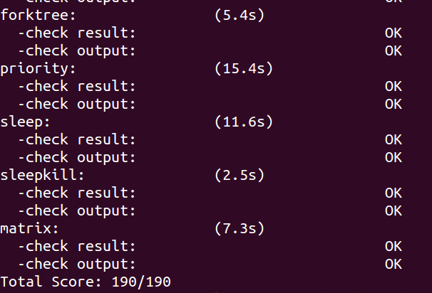
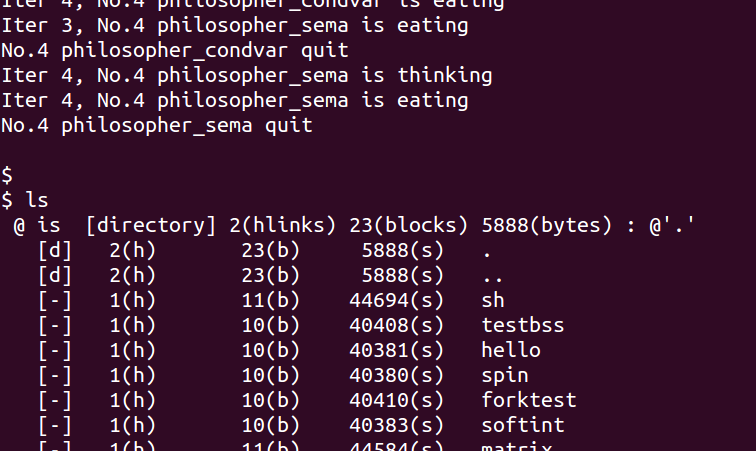

# LAB8 文件系统

## 练习1: 完成读文件操作的实现

用户进程调用 `open` 函数，`open` 调用 `sys_open` 通过系统中断调用内核中的 `sysfile_open` 函数 (定义于 `kern/fs/sysfile.c`)，并进一步调用 `file_open` 函数 (定义于 `kern/fs/file.c`)。在 `file_open` 函数中，程序主要做了以下几个操作：

1. 调用 `fd_array_alloc` 在当前进程的打开文件表中获取一个空闲的 `file` 对象。
2. 调用 `vfs_open` 函数，并存储该函数返回的 `inode` 结构。
3. 根据上一步返回的 `inode` 和 `open_flags` 设置 `file` 对象的读写属性和 `open_count`。如果打开方式是 `append`，则还会调用 `vop_fstat` (实际是 `sfs_fstat`) 获取文件信息，设置 `file` 的 `pos` 成员为当前文件的大小。
4. 最后返回 `file->fd`。

```c
int
file_open(char *path, uint32_t open_flags) {
    bool readable = 0, writable = 0;
    switch (open_flags & O_ACCMODE) {
    case O_RDONLY: readable = 1; break;
    case O_WRONLY: writable = 1; break;
    case O_RDWR:
        readable = writable = 1;
        break;
    default:
        return -E_INVAL;
    }

    int ret;
    struct file *file;
    if ((ret = fd_array_alloc(NO_FD, &file)) != 0) {
        return ret;
    }

    struct inode *node;
    if ((ret = vfs_open(path, open_flags, &node)) != 0) {
        fd_array_free(file);
        return ret;
    }

    file->pos = 0;
    if (open_flags & O_APPEND) {
        struct stat __stat, *stat = &__stat;
        if ((ret = vop_fstat(node, stat)) != 0) {
            vfs_close(node);
            fd_array_free(file);
            return ret;
        }
        file->pos = stat->st_size;
    }

    file->node = node;
    file->readable = readable;
    file->writable = writable;
    fd_array_open(file);
    return file->fd;
}
```

`vfs_open` 函数主要完成以下操作:

1. 调用 `vfs_lookup` 搜索给出的路径，判断是否存在该文件。如果存在，则 `vfs_lookup` 函数返回该文件所对应的 `inode` 节点至当前函数 `vfs_open` 中的局部变量 `node`。
2. 如果给出的路径不存在，即文件不存在，则根据传入的 `flag`，选择调用 `vop_create` 创建新文件或直接返回错误信息。
3. 执行到此步时，当前函数中的局部变量 `node` 一定非空，此时进一步调用 `vop_open` 函数打开文件。
4. 如果文件打开正常，则根据当前函数传入的 `open_flags` 参数来判断是否需要将当前文件截断 (truncate) 至 0 (即清空)。如果需要截断，则执行 `vop_truncate` 函数。最后函数返回。
    - `vop_truncate` 函数 (即 `sfs_truncfile` 函数) 获取该文件原先占用磁盘的块数 `nblks`，以及“截断”后占用的块数 `tblks`。这里的“截断”实质上是调整文件尺寸的操作。如果原先占用的磁盘块数比目的块数大，则循环调用 `sfs_bmap_load_nolock` 函数，单次添加一个块。如果原先占用的磁盘块数比目的块数小，则循环调用 `sfs_bmap_truncate_nolock` 函数，单次销毁一个块。

```c
// open file in vfs, get/create inode for file with filename path.
int
vfs_open(char *path, uint32_t open_flags, struct inode **node_store) {
    bool can_write = 0;
    switch (open_flags & O_ACCMODE) {
    case O_RDONLY:
        break;
    case O_WRONLY:
    case O_RDWR:
        can_write = 1;
        break;
    default:
        return -E_INVAL;
    }

    if (open_flags & O_TRUNC) {
        if (!can_write) {
            return -E_INVAL;
        }
    }

    int ret; 
    struct inode *node;
    bool excl = (open_flags & O_EXCL) != 0;
    bool create = (open_flags & O_CREAT) != 0;
    ret = vfs_lookup(path, &node);

    if (ret != 0) {
        if (ret == -16 && (create)) {
            char *name;
            struct inode *dir;
            if ((ret = vfs_lookup_parent(path, &dir, &name)) != 0) {
                return ret;
            }
            ret = vop_create(dir, name, excl, &node);
        } else return ret;
    } else if (excl && create) {
        return -E_EXISTS;
    }
    assert(node != NULL);
    
    if ((ret = vop_open(node, open_flags)) != 0) {
        vop_ref_dec(node);
        return ret;
    }

    vop_open_inc(node);
    if (open_flags & O_TRUNC || create) {
        if ((ret = vop_truncate(node, 0)) != 0) {
            vop_open_dec(node);
            vop_ref_dec(node);
            return ret;
        }
    }
    *node_store = node;
    return 0;
}
```

**接下来实现 `sfs_io_nolock`：**

当进行文件读取/写入操作时，最终 ucore 都会执行到 `sfs_io_nolock` 函数。在该函数中，我们要完成对设备上基础块数据的读取与写入。在进行读取/写入前，我们需要先将数据与基础块对齐，以便于使用 `sfs_block_op` 函数直接读取块，提高读取/写入效率。因此就需要特殊处理起始和结束的非对齐部分。

1. 处理起始非对齐部分: 第一个块的块内偏移量 `blkoff` 如果不是块对齐的，需要单独处理第一个块到块尾的部分。如果待读写的页不到一整页，则直接读写完所有数据 (`size=endpos - offset`)。调用 `sfs_bmap_load_nolock` 获取文件中第 `blkno` 块数据所处的实际磁盘物理块编号，如果 `blkno` 等于文件块数，将会自动分配新的块。然后根据获得的物理块号调用 `sfs_buf_op` (`sfs_rbuf` 或 `sfs_wbuf`) 读写。
2. 处理中间对齐的整块: 对于跨越的完整磁盘块，直接调用 `sfs_block_op` (`sfs_rblock` 或 `sfs_wblock`) 读取 `nblks` 个块。
3. 处理末尾非对齐部分: 如果结束位置 `endpos` 不是块对齐的，需要单独处理最后一个块内从块首到 `endpos % SFS_BLKSIZE` 的部分。同样调用 `sfs_bmap_load_nolock` 和 `sfs_buf_op`。
4. 同时还要更新 `*alenp` 为实际读/写的字节数。最后如果写操作导致文件大小增加，更新 `sin->din->size` 并标记 `sin->dirty = 1`。

```c
static int
sfs_io_nolock(struct sfs_fs *sfs, struct sfs_inode *sin, void *buf, off_t offset, size_t *alenp, bool write) {
    struct sfs_disk_inode *din = sin->din;
    assert(din->type != SFS_TYPE_DIR);
    off_t endpos = offset + *alenp, blkoff;
    *alenp = 0;
	// calculate the Rd/Wr end position
    if (offset < 0 || offset >= SFS_MAX_FILE_SIZE || offset > endpos) {
        return -E_INVAL;
    }
    if (offset == endpos) {
        return 0;
    }
    if (endpos > SFS_MAX_FILE_SIZE) {
        endpos = SFS_MAX_FILE_SIZE;
    }
    if (!write) {
        if (offset >= din->size) {
            return 0;
        }
        if (endpos > din->size) {
            endpos = din->size;
        }
    }

    int (*sfs_buf_op)(struct sfs_fs *sfs, void *buf, size_t len, uint32_t blkno, off_t offset);
    int (*sfs_block_op)(struct sfs_fs *sfs, void *buf, uint32_t blkno, uint32_t nblks);
    if (write) {
        sfs_buf_op = sfs_wbuf, sfs_block_op = sfs_wblock;
    }
    else {
        sfs_buf_op = sfs_rbuf, sfs_block_op = sfs_rblock;
    }

    int ret = 0;
    size_t size, alen = 0;
    uint32_t ino;
    uint32_t blkno = offset / SFS_BLKSIZE;          // The NO. of Rd/Wr begin block
    uint32_t nblks = endpos / SFS_BLKSIZE - blkno;  // The size of Rd/Wr blocks

  //LAB8:EXERCISE1 YOUR CODE
    if (blkoff = offset % SFS_BLKSIZE) { // (1)
        size = (nblks != 0) ? (SFS_BLKSIZE - blkoff) : (endpos - offset);
        if ((ret = sfs_bmap_load_nolock(sfs, sin, blkno, &ino)) != 0)
            goto out;
        if ((ret = sfs_buf_op(sfs, buf, size, ino, blkoff)) != 0)
            goto out;
        alen += size;
        buf += size;
        offset += size;
        blkno ++;
        if (nblks == 0)
            goto out;
        else
            nblks --;
    }
    if (nblks > 0) { // (2)
        if ((ret = sfs_bmap_load_nolock(sfs, sin, blkno, &ino)) != 0)
            goto out;
        if ((ret = sfs_block_op(sfs, buf, ino, nblks)) != 0)
            goto out;
        buf += nblks * SFS_BLKSIZE;
        alen += nblks * SFS_BLKSIZE;
        blkno += nblks;
    }
    if (endpos % SFS_BLKSIZE) { // (3)
        size = endpos % SFS_BLKSIZE;
        if ((ret = sfs_bmap_load_nolock(sfs, sin, blkno, &ino)) != 0)
            goto out;
        if ((ret = sfs_buf_op(sfs, buf, size, ino, 0)) != 0)
            goto out;
        alen += size;
    }
out:
    *alenp = alen;
    if (offset + alen > sin->din->size) {
        sin->din->size = offset + alen;
        sin->dirty = 1;
    }
    return ret;
}
```


> 请在实验报告中给出设计实现 “UNIX 的 PIPE 机制” 的概要设计方案，鼓励给出详细设计方案

管道是 UNIX 中的一种进程间通信 (IPC) 机制，提供单向的字节流。它有一个写入端和一个读取端。写入管道的数据由内核缓冲，直到被读取端消耗。管道通常用于连接一个进程的标准输出到另一个进程的标准输入。
*   匿名管道: 通过 `pipe()` 系统调用创建，只能在有亲缘关系的进程 (如父子进程) 之间使用，因为文件描述符是通过 `fork()` 继承的。
*   命名管道: 通过 `mkfifo()` 创建，在文件系统中拥有一个路径名，因此不相关的进程可以通过打开这个路径名来访问同一个 FIFO。

ucore 的 `sysfile.h` 和 `file.h` 已经预留了相关接口：

```c
int sysfile_pipe(int *fd_store);
int sysfile_mkfifo(const char *name, uint32_t open_flags);

int file_pipe(int fd[]);
int file_mkfifo(const char *name, uint32_t open_flags);
```

首先需要为管道创建一个数据结构 `pipe_struct`，用于存储管道的状态和数据缓冲区。包括
  - 一个循环缓冲区
  - 当前写入的位置和读取的位置
  - 写入端和读取端是否关闭
  - 互斥和同步的信号量

然后扩充 `file` 的定义，使其能代表管道的一端。新增一个成员指向共享的 `pipe_struct`，这样多个读端/写端就会共享读取的进度。

对文件进行操作的时候，判断是否为管道，如果是，则调用管道对应的 `ops` 函数。

对于命名管道，它在文件系统中表现为一个特殊类型的文件。
*   `sfs.h` 中定义的文件类型需要增加 `SFS_TYPE_FIFO`，并为需要为 FIFO 类型定义相应的 `inode_ops`。
    *   `vop_open`: 打开 FIFO 时，需要关联到或创建一个 `pipe_struct`。
    *   `vop_close`: 关闭 FIFO 时，需要更新 `pipe_struct` 的引用计数或关闭状态。
    *   `vop_read`/`vop_write`: 对于 FIFO 的 `inode`，这些操作应委托给其关联的 `pipe_struct` 的 `pipe_read`/`pipe_write`。
    *   其他操作如 `vop_fstat` 应能正确报告文件类型为 FIFO。`vop_seek` 对 FIFO 通常无效。

对于匿名管道，它们不直接对应于磁盘上的 `inode`。当创建匿名管道时，不分配磁盘 `inode`，`file->node` 可以为 `NULL`。


## 练习2: 完成基于文件系统的执行程序机制的实现

可以在 Lab 7 的基础上进行修改，读 ELF 文件变成从磁盘上读，而不是直接在内存中读。

1. **修改 `alloc_proc`**
   
   在 `proc.c` 中，根据注释我们需要先初始化 `fs` 中的进程控制结构，即在 `alloc_proc` 函数中我们需要做一下修改，加上一句 `proc->filesp = NULL;` 从而完成初始化。

2. **修改 `do_fork`**

   `fork` 机制在原先 Lab 7 的基础上，多了 `file_struct` 结构的复制操作与执行失败时的重置操作，分别需要调用 `copy_files` `put_files` 函数。
   ```c
   int
   do_fork(uint32_t clone_flags, uintptr_t stack, struct trapframe *tf) {
       int ret = -E_NO_FREE_PROC;
       struct proc_struct *proc;
       if (nr_process >= MAX_PROCESS) {
           goto fork_out;
       }
       ret = -E_NO_MEM;
       
       if ((proc = alloc_proc()) == NULL) {
           goto fork_out;
       } 
       proc->parent = current;
       assert(current->wait_state == 0); 
       if (setup_kstack(proc) != 0) {
           goto bad_fork_cleanup_proc;
       }
       if (copy_files(clone_flags, proc) != 0) { // LAB8 将当前进程的fs复制到fork出的进程中
           goto bad_fork_cleanup_kstack;
       }    
       if (copy_mm(clone_flags, proc) != 0) {
           goto bad_fork_cleanup_kstack;
       }
       copy_thread(proc, stack, tf); 
       bool intr_flag;
       local_intr_save(intr_flag);
       {
           proc->pid = get_pid();
           hash_proc(proc);
           set_links(proc); 
       }
       local_intr_restore(intr_flag); 
       wakeup_proc(proc); 
       ret = proc->pid;
   fork_out:
       return ret; 
   bad_fork_cleanup_fs:  //for LAB8
       put_files(proc);
   bad_fork_cleanup_kstack:
       put_kstack(proc);
   bad_fork_cleanup_proc:
       kfree(proc);
       goto fork_out;
   }
   ```

3. **修改 `load_icode`**
   
   原先 Lab 7 源码中，`load_icode` 接收一个指向内存中二进制程序映像的指针 `binary` 和其大小 `size`。这意味着在调用 `load_icode` 之前，整个可执行文件 (如 ELF 文件) 的内容已经被完整地加载到了内核的某块内存区域，但在 Lab 8 中，程序的内容将按需调用 `load_icode_read` 来从磁盘上的文件读取 ELF header 以及各个段的数据。
   
   此外，原先 Lab 7 的 `load_icode` 函数中并没有对 `execve` 所执行的程序传入参数 (`u_argc`, `u_argv`)，而我们需要在 Lab 8 中补充这个实现。

   主要步骤如下：
   1. 读取文件头部得到 ELF header，然后通过 `elfhdr->e_phoff` 找到第一个程序段头，遍历每一个程序段头：
      - 把程序段头读取出来，使用 `mm_map` 分配虚拟空间，然后对于 `p_filesz > 0` 的段，需要读入内存并分配物理页。
      - 对于包含 BSS 的部分，需要多分配 `p_memsz - p_filesz` 的空间并清零。
   2. 关闭读取的 ELF。
   3. 预先为栈顶附近的几页分配物理页并建立页表映射。
   4. 加载新的 `CR3` 值，切换到新进程的地址空间。
   5. 将参数压入用户栈。参数的顺序如下所示。
      - 先计算出所有参数的长度，与 `long` 对齐，找到起始放置的位置。
      - 计算出指向参数的指针数组需要的空间，找到起始放置的位置。
      - 将参数从内核空间一个个复制到用户栈，并让参数指针指向参数值。
      - 最后压入 `argc`。
   6. 置用户栈顶为 `argc` 的位置。
    ```
    ---------------- high
    |  所有参数的值 |
    |              |
    ----------------
    |  指向每个参数 |
    |  的指针 argv |
    ----------------
    |     argc     | <-- user esp
    ---------------- low
    ```

   ```c
    static int
    load_icode(int fd, int argc, char **kargv) {
        assert(argc >= 0 && argc <= EXEC_MAX_ARG_NUM);

        if (current->mm != NULL) {
            panic("load_icode: current->mm must be empty.\n");
        }

        int ret = -E_NO_MEM;
        struct mm_struct *mm;
        //(1) create a new mm for current process
        if ((mm = mm_create()) == NULL) {
            goto bad_mm;
        }
        //(2) create a new PDT, and mm->pgdir= kernel virtual addr of PDT
        if (setup_pgdir(mm) != 0) {
            goto bad_pgdir_cleanup_mm;
        }
        //(3) copy TEXT/DATA section, build BSS parts in binary to memory space of process
        struct Page *page;
        // (3.1) read raw data content in file and resolve elfhdr
        struct elfhdr __elf, *elf = &__elf;
        if ((ret = load_icode_read(fd, elf, sizeof(struct elfhdr), 0)) != 0) {
            goto bad_elf_cleanup_pgdir;
        }
        if (elf->e_magic != ELF_MAGIC) {
            ret = -E_INVAL_ELF;
            goto bad_elf_cleanup_pgdir;
        }
        // (3.2) read raw data content in file and resolve proghdr based on info in elfhdr
        struct proghdr __ph, *ph = &__ph;
        uint32_t vm_flags, perm, phnum;
        for (phnum = 0; phnum < elf->e_phnum; phnum ++) {
            off_t phoff = elf->e_phoff + sizeof(struct proghdr) * phnum;
            if ((ret = load_icode_read(fd, ph, sizeof(struct proghdr), phoff)) != 0) {
                goto bad_cleanup_mmap;
            }
            if (ph->p_type != ELF_PT_LOAD) {
                continue ;
            }
            if (ph->p_filesz > ph->p_memsz) {
                ret = -E_INVAL_ELF;
                goto bad_cleanup_mmap;
            }
            if (ph->p_filesz == 0) {
                continue ;
            }
        //(3.3) call mm_map to build vma related to TEXT/DATA
            vm_flags = 0, perm = PTE_U;
            if (ph->p_flags & ELF_PF_X) vm_flags |= VM_EXEC;
            if (ph->p_flags & ELF_PF_W) vm_flags |= VM_WRITE;
            if (ph->p_flags & ELF_PF_R) vm_flags |= VM_READ;
            if (vm_flags & VM_WRITE) perm |= PTE_W;
            if ((ret = mm_map(mm, ph->p_va, ph->p_memsz, vm_flags, NULL)) != 0) {
                goto bad_cleanup_mmap;
            }
            off_t offset = ph->p_offset;
            size_t off, size;
            uintptr_t start = ph->p_va, end, la = ROUNDDOWN(start, PGSIZE);

            ret = -E_NO_MEM;

        //(3.6) alloc memory, and  copy the contents of every program section (from, from+end) to process's memory (la, la+end)
            end = ph->p_va + ph->p_filesz;
        //(3.4) callpgdir_alloc_page to allocate page for TEXT/DATA, read contents in file and copy them into the new allocated pages
            while (start < end) {
                // 设置该内存所对应的页表项
                if ((page = pgdir_alloc_page(mm->pgdir, la, perm)) == NULL) {
                    goto bad_cleanup_mmap;
                }
                off = start - la, size = PGSIZE - off, la += PGSIZE;
                if (end < la) {
                    size -= la - end;
                }
                // LAB8 读取elf对应段内的数据并写入至该内存中
                if ((ret = load_icode_read(fd, page2kva(page) + off, size, offset)) != 0) {
                    goto bad_cleanup_mmap;
                }
                start += size, offset += size;
            }
            //(3.5) callpgdir_alloc_page to allocate pages for BSS, memset zero in these pages        
            end = ph->p_va + ph->p_memsz;
            if (start < la) {
                /* ph->p_memsz == ph->p_filesz */
                if (start == end) {
                    continue ;
                }
                off = start + PGSIZE - la, size = PGSIZE - off;
                if (end < la) {
                    size -= la - end;
                }
                memset(page2kva(page) + off, 0, size);
                start += size;
                assert((end < la && start == end) || (end >= la && start == la));
            }
            while (start < end) {
                if ((page = pgdir_alloc_page(mm->pgdir, la, perm)) == NULL) {
                    ret = -E_NO_MEM;
                    goto bad_cleanup_mmap;
                }
                off = start - la, size = PGSIZE - off, la += PGSIZE;
                if (end < la) {
                    size -= la - end;
                }
                memset(page2kva(page) + off, 0, size);
                start += size;
            }
        }
        // 关闭读取的ELF
        sysfile_close(fd);

        //(4) build user stack memory
        vm_flags = VM_READ | VM_WRITE | VM_STACK;
        if ((ret = mm_map(mm, USTACKTOP - USTACKSIZE, USTACKSIZE, vm_flags, NULL)) != 0) {
            goto bad_cleanup_mmap;
        }
        assert(pgdir_alloc_page(mm->pgdir, USTACKTOP-PGSIZE , PTE_USER) != NULL);
        assert(pgdir_alloc_page(mm->pgdir, USTACKTOP-2*PGSIZE , PTE_USER) != NULL);
        assert(pgdir_alloc_page(mm->pgdir, USTACKTOP-3*PGSIZE , PTE_USER) != NULL);
        assert(pgdir_alloc_page(mm->pgdir, USTACKTOP-4*PGSIZE , PTE_USER) != NULL);

        //(5) set current process's mm, sr3, and set CR3 reg = physical addr of Page Directory
        mm_count_inc(mm);
        current->mm = mm;
        current->cr3 = PADDR(mm->pgdir);
        lcr3(PADDR(mm->pgdir));

        //(6) setup uargc and uargv in user stacks
        uint32_t argv_size=0, i;
        for (i = 0; i < argc; i ++) {
            argv_size += strnlen(kargv[i],EXEC_MAX_ARG_LEN + 1)+1;
        }
        
        uintptr_t stacktop = USTACKTOP - (argv_size/sizeof(long)+1)*sizeof(long);
        // 直接将传入的参数压入至新栈的底部
        char** uargv=(char **)(stacktop  - argc * sizeof(char *));
        
        argv_size = 0;
        for (i = 0; i < argc; i ++) {
            uargv[i] = strcpy((char *)(stacktop + argv_size ), kargv[i]);
            argv_size +=  strnlen(kargv[i],EXEC_MAX_ARG_LEN + 1)+1;
        }
        
        stacktop = (uintptr_t)uargv - sizeof(int);
        *(int *)stacktop = argc;
        
        //(7) setup trapframe for user environment
        struct trapframe *tf = current->tf;
        memset(tf, 0, sizeof(struct trapframe));
        tf->tf_cs = USER_CS;
        tf->tf_ds = tf->tf_es = tf->tf_ss = USER_DS;
        tf->tf_esp = stacktop;
        tf->tf_eip = elf->e_entry;
        tf->tf_eflags = FL_IF;
        ret = 0;
    out:
        return ret;
    bad_cleanup_mmap:
        exit_mmap(mm);
    bad_elf_cleanup_pgdir:
        put_pgdir(mm);
    bad_pgdir_cleanup_mm:
        mm_destroy(mm);
    bad_mm:
        goto out;
    }
    ```
    
> 请在实验报告中给出设计实现基于“UNIX的硬链接和软链接机制”的概要设计方案，鼓励给出详细设计方案

- 硬链接 (Hard Link): 多个目录项指向同一个文件的 inode。删除一个硬链接不会删除文件本身，直到所有指向该 inode 的链接都被删除，且文件没有被任何进程打开时，文件的数据块才会被回收。硬链接不能跨文件系统，通常也不能指向目录。
- 软链接 (Symbolic Link / Symlink): 一个特殊类型的文件，其内容是另一个文件或目录的路径名。访问软链接时，操作系统会解析其内容，并重定向到目标路径。删除软链接不影响目标文件。软链接可以跨文件系统，也可以指向目录。

ucore 已经为实现软硬链接预留了接口：
- sfs.h 中定义的 sfs_disk_inode 结构体中有 nlinks 属性，file types 也已经包含了 SFS_TYPE_LINK 的链接类型。
- vfs.h 中已经声明了VFS 层需要提供的操作接的通用接口，相应的系统调用接口也已经在 sysfile.h 存在
    ```c
    int vfs_link(char *old_path, char *new_path);
    int vfs_symlink(char *old_path, char *new_path);
    int vfs_readlink(char *path, struct iobuf *iob);
    int vfs_unlink(char *path);
    ```
    ```c
    int sysfile_link(const char *old_path, const char *new_path);
    int sysfile_symlink(const char *target_path, const char *link_path);
    int sysfile_unlink(const char *path);
    int sysfile_readlink(const char *path, char *buf, size_t len);
    ```

链接的创建与删除：

- 创建硬链接时，仍然为new_path建立一个sfs_disk_entry结构，但该结构的内部ino成员指向old_path的磁盘索引结点，并使该磁盘索引节点的nlinks引用计数成员加一即可。
删除硬链接时，令对应磁盘结点sfs_disk_inode中的nlinks减一，同时删除硬链接的sfs_disk_entry结构即可。
软链接的实现

- 与创建硬链接不同，创建软链接时要多建立一个sfs_disk_inode结构。之后，将old_path写入该文件中，并标注sfs_disk_inode的type为SFS_TYPE_LINK即可。删除软链接与删除文件的操作没有区别，直接将对应的sfs_disk_entry和sfs_disk_inode结构删除即可。

读取链接：

- 读取软链接 (`xx_readlink`)需要从 path 对应的 inode 的数据块中读取其内容 (即目标路径字符串)。这可以通过 `sfs_io_nolock` (或其内部逻辑) 实现，从偏移量 0 开始读取，长度为 `link_node->din->size`。将读取到的内容存入 `iob`返回
- 之后软硬链接都正常读取路径即可。

调整路径解析使其能够处理软链接：

1.  当 `vfs_lookup_path` (或其内部组件如 `vfs_lookup_once`) 查找到一个 inode 时，需要检查其类型。
2.  如果为 `SFS_TYPE_LINK`：
    *   调用 `vop_readlink(inode, &iob_for_target_path)` 读取软链接的内容 (目标路径)。
    *   对读取到的目标路径进行解析：
        *   如果目标路径是绝对路径，则从根目录开始重新查找。
        *   如果目标路径是相对路径，则从当前软链接所在的目录开始查找。
    *   需要有一个计数器来防止软链接解析陷入无限循环 (例如，A 指向 B，B 指向 A)。如果解析深度超过某个阈值 (如 `MAX_SYMLINKS`)，则返回错误 (`-E_LOOP`)。
    *   解析完目标路径后，用解析到的新 inode 替换当前的 inode，并继续路径的剩余部分。


最后，需要将新实现的这些操作的函数指针注册到 SFS 的 `struct inode_ops` 实例中。

## 实验结果

输入 `make grade` 得到满分：



可以在终端执行用户程序：

